# 基于传染病动力学模型与机器学习方法的疫情传播预测研究

## 摘要

本文基于 Johns Hopkins University CSSE COVID-19 全球时间序列数据，对 China 疫情传播趋势进行建模分析。研究首先将累计确诊、死亡、治愈数据转换为每日新增序列，并对负新增值进行 0 截断以处理统计回补和口径修正。随后使用固定参数 SIR、时变参数 SIR 与 GradientBoosting 回归模型分别完成舱室变量拟合、每日新增预测和未来 7 天、14 天趋势预测。实验同时补充省份层面的区域传播趋势图，用于展示不同地区之间的传播差异。

**关键词：** 疫情传播；SIR 模型；时变参数；GradientBoosting；时间序列预测；模型评价

## 一、引言

疫情数据具有明显的时间依赖性、阶段性和区域差异。传统传染病动力学模型能够解释易感者、感染者和移除者之间的转化关系，机器学习模型则更适合利用滞后项、滑动统计量和日期特征进行短期预测。本文的目标不是追求复杂模型堆叠，而是建立一个可运行、可解释、结果可复现的课程建模流程。

## 二、数据来源与预处理

数据来源为 JHU CSSE COVID-19 global time series，使用的核心文件包括累计确诊、累计死亡和累计治愈三类时间序列。本文分析区域为 China，省份参数为 Mainland，时间范围为 2020-01-22 至 2023-03-09，共 1143 天。期末累计确诊为 502,088，累计死亡为 5,273，累计治愈为 87,453。

累计值转换为每日新增值时采用相邻日期差分：

```python
daily_new = cumulative.diff().fillna(cumulative.iloc[0])
daily_new = daily_new.clip(lower=0)
```

这样处理可以避免数据回补造成的负新增值直接进入模型。JHU recovered 序列在 2021-08-05 后存在终端归零或停止更新现象，程序将该日期后的治愈累计值视为缺失，不伪造治愈人数。

## 三、疫情传播规律与区域趋势分析

全国累计和每日新增趋势如下。累计曲线反映疫情总规模，每日新增 7 日均值用于减弱单日上报波动。

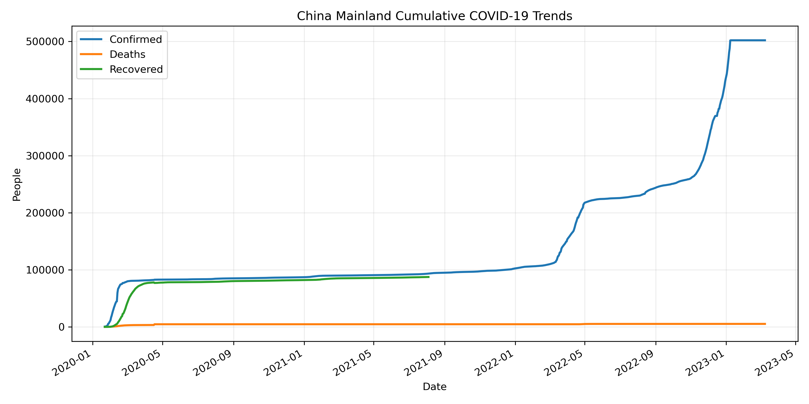

图 1 全国累计确诊、死亡、治愈趋势

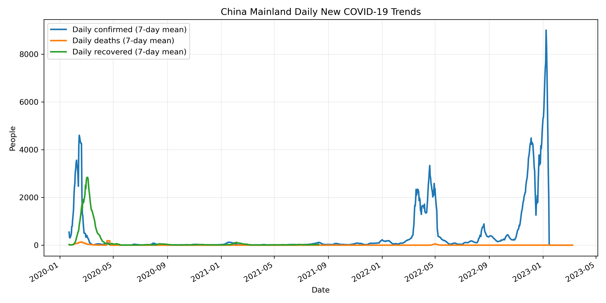

图 2 全国每日新增确诊、死亡、治愈趋势

为满足区域传播趋势分析要求，本文进一步使用省份层面数据绘制各省累计确诊趋势、各省每日新增确诊趋势以及 Top 10 省份对比图。灰色线表示其他省份，彩色线突出最终累计确诊数最高的省份。JHU 数据中的 Unknown 属于未分配地区，汇总 CSV 中保留该行，但 Top 10 省份图和下表不将其作为省份排序对象。

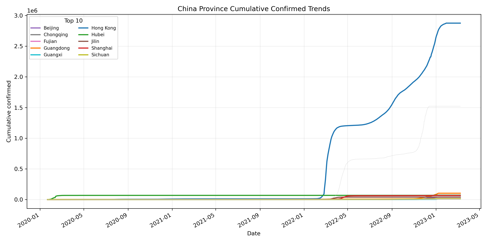

图 3 各省累计确诊趋势

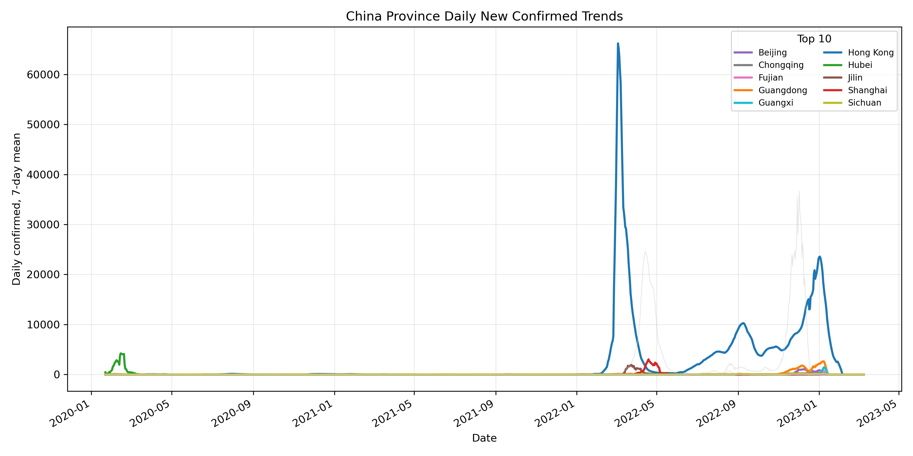

图 4 各省每日新增确诊 7 日均值趋势

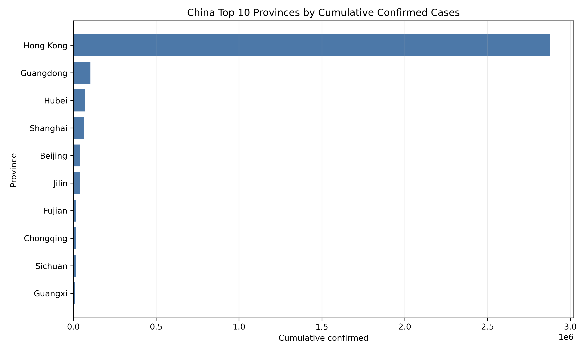

图 5 Top 10 省份累计确诊对比

Top 10 省份汇总如下：

| province | final_cumulative_confirmed | total_daily_confirmed | peak_daily_confirmed |
| --- | --- | --- | --- |
| Hong Kong | 2,876,106.000 | 2,876,130.000 | 76,991.000 |
| Guangdong | 103,248.000 | 103,248.000 | 3,508.000 |
| Hubei | 72,131.000 | 72,132.000 | 14,840.000 |
| Shanghai | 67,040.000 | 67,629.000 | 5,489.000 |
| Beijing | 40,774.000 | 40,775.000 | 2,360.000 |
| Jilin | 40,764.000 | 40,765.000 | 4,222.000 |
| Fujian | 17,122.000 | 17,195.000 | 1,234.000 |
| Chongqing | 14,715.000 | 14,715.000 | 654.000 |
| Sichuan | 14,567.000 | 14,567.000 | 475.000 |
| Guangxi | 13,371.000 | 13,371.000 | 2,046.000 |

## 四、固定参数 SIR 模型

SIR 模型将人群划分为易感者 S、感染者 I 和移除者 R。本文用累计治愈人数与累计死亡人数之和近似 R，用累计确诊减去移除者近似当前感染者 I。模型方程为：

```text
dS/dt = -beta * S * I / N
dI/dt = beta * S * I / N - gamma * I
dR/dt = gamma * I
```

其中 beta 表示传播率，gamma 表示移除率，beta/gamma 可作为基本传播强度的近似指标。降低接触率会降低 beta，提高救治和隔离效率会提高 gamma，从而有助于控制传播。

固定参数 SIR 拟合参数如下：

| fit_start_date | fit_end_date | fit_days | beta | gamma | R0_beta_over_gamma | effective_population |
| --- | --- | --- | --- | --- | --- | --- |
| 2020-01-22 | 2020-07-19 | 180.000 | 0.327 | 0.048 | 6.805 | 84,516.800 |

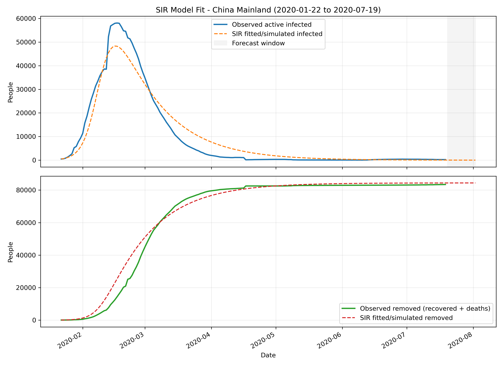

图 6 固定参数 SIR 模型拟合结果

## 五、时变参数 SIR 模型

固定参数 SIR 假设 beta 和 gamma 在整个窗口内不变，而真实疫情会受到检测能力、隔离政策、医疗资源和公众行为变化影响。时变参数 SIR 允许传播率和移除率随时间变化，更适合描述干预措施明显变化的阶段。

时变参数 SIR 主要参数如下：

| fit_start_date | fit_end_date | fit_days | mean_beta | mean_gamma | mean_R0_beta_over_gamma | final_R0_beta_over_gamma |
| --- | --- | --- | --- | --- | --- | --- |
| 2020-01-22 | 2020-07-19 | 180.000 | 0.075 | 0.064 | 1.178 | 0.555 |

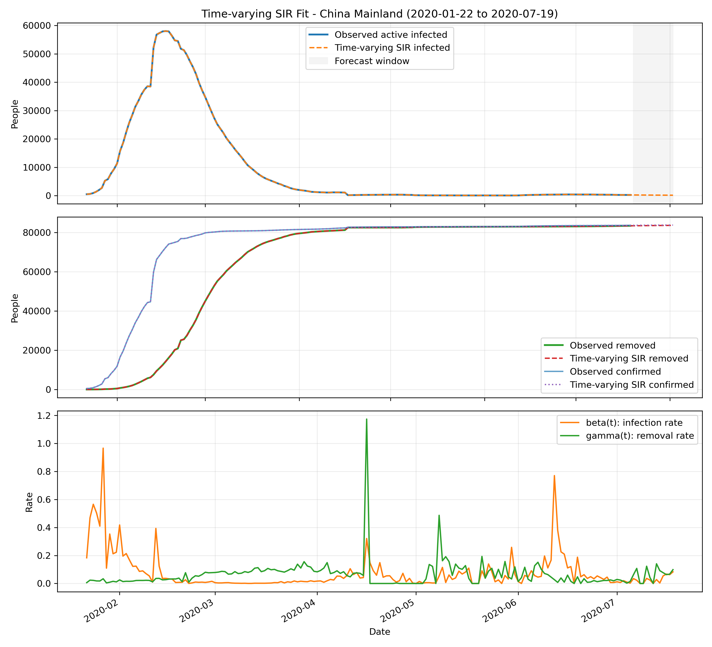

图 7 时变参数 SIR 模型拟合结果

## 六、GradientBoosting 每日新增预测

机器学习部分使用 GradientBoostingRegressor 作为主要模型，分别预测每日新增确诊、每日新增死亡和每日新增治愈。特征包括最近 1 至 14 天及 21、28 天滞后值，3、7、14、28 日滑动均值、滑动中位数、滑动标准差、指数滑动均值、日期序号、星期和月份等。训练集与测试集按时间顺序划分，不随机打乱，避免时间序列未来信息泄露。

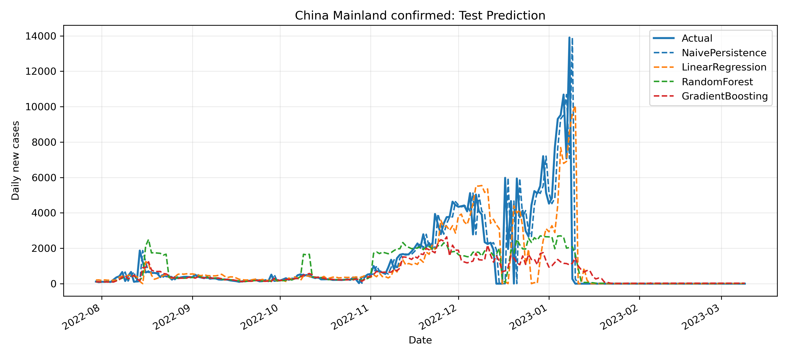

图 8 每日新增确诊测试集预测对比

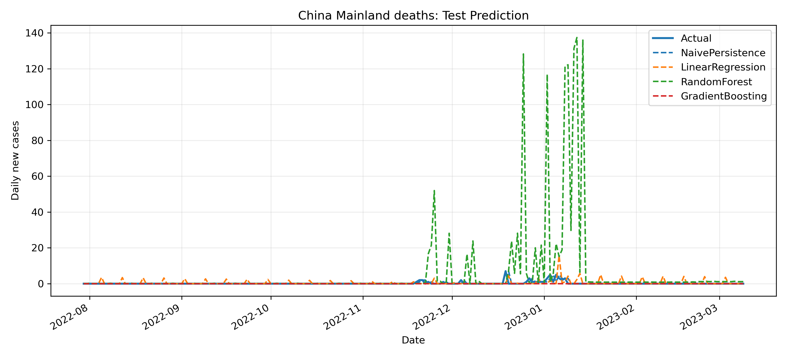

图 9 每日新增死亡测试集预测对比

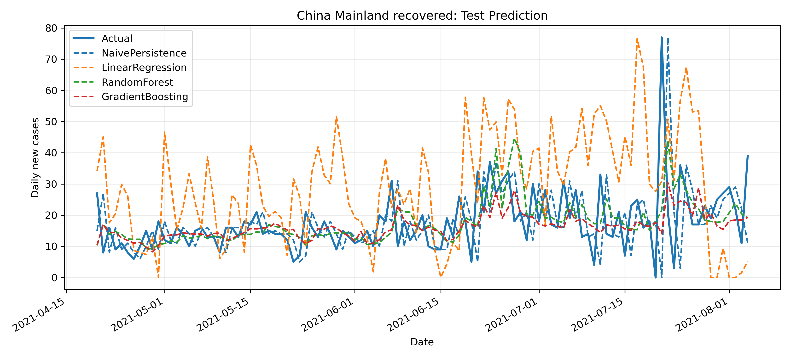

图 10 每日新增治愈测试集预测对比

## 七、GradientBoosting 舱室变量同窗口实验

为了让传统模型和机器学习模型在同一类舱室数据上可比，本文额外将 GradientBoosting 应用于 SIR 相同观测窗口下的 infected、removed 和 confirmed 三个变量。该实验使用同一段 SIR 观测数据构造滞后特征，并在窗口内部进行按时间顺序的训练/测试划分。

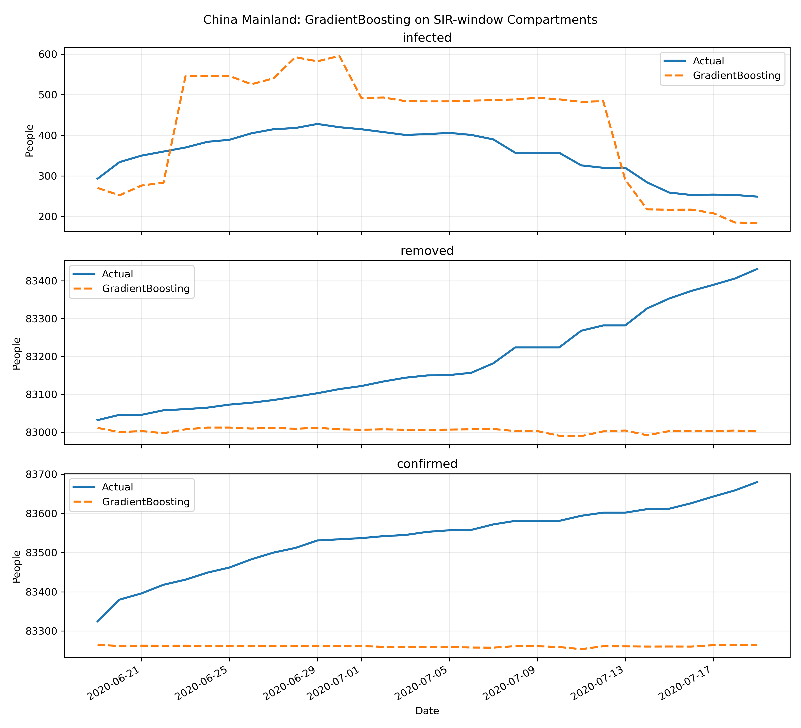

图 11 GradientBoosting 舱室变量同窗口测试预测

## 八、未来 7 天和 14 天趋势预测

模型完成测试集评估后，使用最近历史值递推构造未来特征，分别输出未来 7 天和 14 天的每日新增预测。

未来 7 天预测结果：

| target | model | date | forecast_day | prediction |
| --- | --- | --- | --- | --- |
| confirmed | NaivePersistence | 2023-03-10 | 1.000 | 0.000 |
| confirmed | NaivePersistence | 2023-03-11 | 2.000 | 0.000 |
| confirmed | NaivePersistence | 2023-03-12 | 3.000 | 0.000 |
| confirmed | NaivePersistence | 2023-03-13 | 4.000 | 0.000 |
| confirmed | NaivePersistence | 2023-03-14 | 5.000 | 0.000 |
| confirmed | NaivePersistence | 2023-03-15 | 6.000 | 0.000 |
| confirmed | NaivePersistence | 2023-03-16 | 7.000 | 0.000 |
| confirmed | LinearRegression | 2023-03-10 | 1.000 | 27.542 |
| confirmed | LinearRegression | 2023-03-11 | 2.000 | 190.824 |
| confirmed | LinearRegression | 2023-03-12 | 3.000 | 211.619 |
| confirmed | LinearRegression | 2023-03-13 | 4.000 | 253.955 |
| confirmed | LinearRegression | 2023-03-14 | 5.000 | 247.775 |
| confirmed | LinearRegression | 2023-03-15 | 6.000 | 151.030 |
| confirmed | LinearRegression | 2023-03-16 | 7.000 | 135.391 |
| confirmed | RandomForest | 2023-03-10 | 1.000 | 14.966 |
| confirmed | RandomForest | 2023-03-11 | 2.000 | 14.140 |
| confirmed | RandomForest | 2023-03-12 | 3.000 | 25.729 |
| confirmed | RandomForest | 2023-03-13 | 4.000 | 27.224 |
| confirmed | RandomForest | 2023-03-14 | 5.000 | 33.490 |
| confirmed | RandomForest | 2023-03-15 | 6.000 | 37.290 |
| confirmed | RandomForest | 2023-03-16 | 7.000 | 48.945 |

未来 14 天预测结果：

| target | model | date | forecast_day | prediction |
| --- | --- | --- | --- | --- |
| confirmed | NaivePersistence | 2023-03-10 | 1.000 | 0.000 |
| confirmed | NaivePersistence | 2023-03-11 | 2.000 | 0.000 |
| confirmed | NaivePersistence | 2023-03-12 | 3.000 | 0.000 |
| confirmed | NaivePersistence | 2023-03-13 | 4.000 | 0.000 |
| confirmed | NaivePersistence | 2023-03-14 | 5.000 | 0.000 |
| confirmed | NaivePersistence | 2023-03-15 | 6.000 | 0.000 |
| confirmed | NaivePersistence | 2023-03-16 | 7.000 | 0.000 |
| confirmed | NaivePersistence | 2023-03-17 | 8.000 | 0.000 |
| confirmed | NaivePersistence | 2023-03-18 | 9.000 | 0.000 |
| confirmed | NaivePersistence | 2023-03-19 | 10.000 | 0.000 |
| confirmed | NaivePersistence | 2023-03-20 | 11.000 | 0.000 |
| confirmed | NaivePersistence | 2023-03-21 | 12.000 | 0.000 |
| confirmed | NaivePersistence | 2023-03-22 | 13.000 | 0.000 |
| confirmed | NaivePersistence | 2023-03-23 | 14.000 | 0.000 |
| confirmed | LinearRegression | 2023-03-10 | 1.000 | 27.542 |
| confirmed | LinearRegression | 2023-03-11 | 2.000 | 190.824 |
| confirmed | LinearRegression | 2023-03-12 | 3.000 | 211.619 |
| confirmed | LinearRegression | 2023-03-13 | 4.000 | 253.955 |
| confirmed | LinearRegression | 2023-03-14 | 5.000 | 247.775 |
| confirmed | LinearRegression | 2023-03-15 | 6.000 | 151.030 |
| confirmed | LinearRegression | 2023-03-16 | 7.000 | 135.391 |
| confirmed | LinearRegression | 2023-03-17 | 8.000 | 84.555 |
| confirmed | LinearRegression | 2023-03-18 | 9.000 | 25.717 |
| confirmed | LinearRegression | 2023-03-19 | 10.000 | 72.515 |
| confirmed | LinearRegression | 2023-03-20 | 11.000 | 46.575 |
| confirmed | LinearRegression | 2023-03-21 | 12.000 | 30.953 |
| confirmed | LinearRegression | 2023-03-22 | 13.000 | 57.879 |
| confirmed | LinearRegression | 2023-03-23 | 14.000 | 83.869 |
| confirmed | RandomForest | 2023-03-10 | 1.000 | 14.966 |
| confirmed | RandomForest | 2023-03-11 | 2.000 | 14.140 |
| confirmed | RandomForest | 2023-03-12 | 3.000 | 25.729 |
| confirmed | RandomForest | 2023-03-13 | 4.000 | 27.224 |
| confirmed | RandomForest | 2023-03-14 | 5.000 | 33.490 |
| confirmed | RandomForest | 2023-03-15 | 6.000 | 37.290 |
| confirmed | RandomForest | 2023-03-16 | 7.000 | 48.945 |
| confirmed | RandomForest | 2023-03-17 | 8.000 | 45.845 |
| confirmed | RandomForest | 2023-03-18 | 9.000 | 44.739 |
| confirmed | RandomForest | 2023-03-19 | 10.000 | 48.667 |
| confirmed | RandomForest | 2023-03-20 | 11.000 | 47.053 |
| confirmed | RandomForest | 2023-03-21 | 12.000 | 49.611 |
| confirmed | RandomForest | 2023-03-22 | 13.000 | 55.378 |
| confirmed | RandomForest | 2023-03-23 | 14.000 | 59.279 |

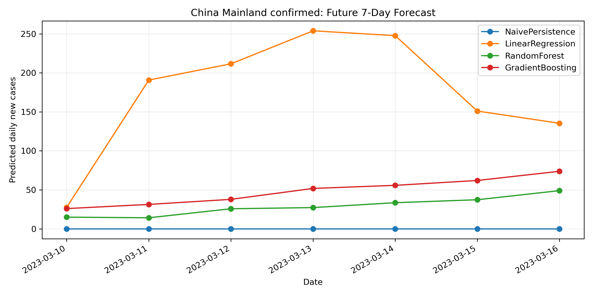

图 12 每日新增确诊未来 7 天预测

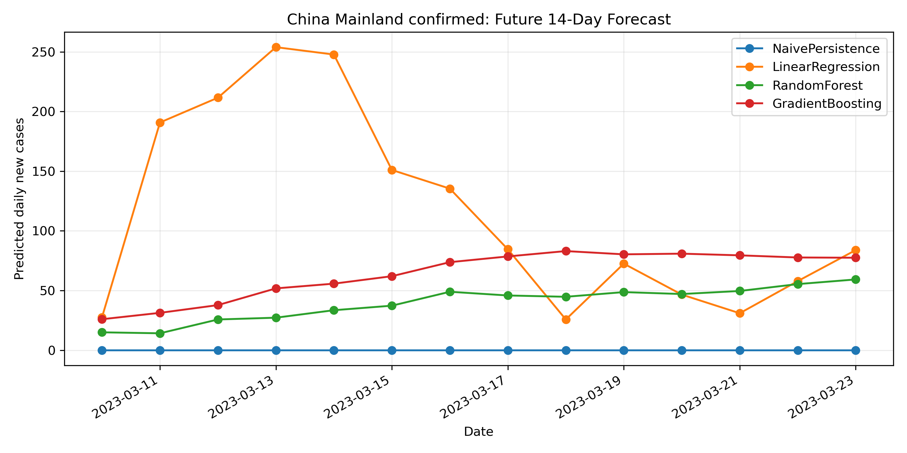

图 13 每日新增确诊未来 14 天预测

## 九、模型评价与对比

本文使用 RMSE、MAE 和 R2 评价模型表现。RMSE 对较大误差更敏感，MAE 表示平均绝对偏差，R2 衡量模型相对均值基线的解释能力。如果 R2 为负，说明模型在该测试集上的效果差于直接使用均值预测，应如实保留。

固定参数 SIR：

| target | model | RMSE | MAE | R2 |
| --- | --- | --- | --- | --- |
| active_infected | SIR | 4,010.700 | 2,797.289 | 0.940 |
| removed | SIR | 3,857.373 | 2,361.081 | 0.983 |
| confirmed | SIR | 2,583.123 | 2,104.141 | 0.986 |

时变参数 SIR：

| target | model | RMSE | MAE | R2 |
| --- | --- | --- | --- | --- |
| active_infected | TimeVaryingSIR | 0.002 | 0.002 | 1.000 |
| removed | TimeVaryingSIR | 0.002 | 0.001 | 1.000 |
| confirmed | TimeVaryingSIR | 0.004 | 0.002 | 1.000 |

GradientBoosting 舱室变量同窗口实验：

| target | model | RMSE | MAE | R2 | evaluation_scope |
| --- | --- | --- | --- | --- | --- |
| infected | GradientBoosting | 111.962 | 101.844 | -2.783 | chronological_test_within_sir_window |
| removed | GradientBoosting | 215.993 | 178.433 | -2.300 | chronological_test_within_sir_window |
| confirmed | GradientBoosting | 288.929 | 276.260 | -10.833 | chronological_test_within_sir_window |

GradientBoosting 每日新增预测：

| target | model | train_rows | test_rows | RMSE | MAE | R2 |
| --- | --- | --- | --- | --- | --- | --- |
| confirmed | NaivePersistence | 892.000 | 223.000 | 1,380.615 | 440.296 | 0.576 |
| confirmed | LinearRegression | 892.000 | 223.000 | 1,584.703 | 675.978 | 0.442 |
| confirmed | RandomForest | 892.000 | 223.000 | 1,671.589 | 752.872 | 0.379 |
| confirmed | GradientBoosting | 892.000 | 223.000 | 1,891.984 | 794.834 | 0.205 |
| deaths | NaivePersistence | 892.000 | 223.000 | 0.898 | 0.224 | -0.191 |
| deaths | LinearRegression | 892.000 | 223.000 | 1.637 | 0.631 | -2.955 |
| deaths | RandomForest | 892.000 | 223.000 | 23.407 | 5.992 | -807.637 |
| deaths | GradientBoosting | 892.000 | 223.000 | 0.850 | 0.211 | -0.066 |
| recovered | NaivePersistence | 426.000 | 107.000 | 13.695 | 8.766 | -0.966 |
| recovered | LinearRegression | 426.000 | 107.000 | 22.222 | 18.226 | -4.177 |
| recovered | RandomForest | 426.000 | 107.000 | 10.148 | 6.996 | -0.079 |
| recovered | GradientBoosting | 426.000 | 107.000 | 9.817 | 6.359 | -0.010 |

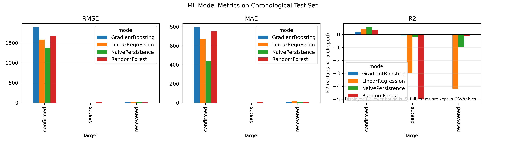

图 14 GradientBoosting 每日新增预测指标对比

## 十、结论与不足

本文完成了从 JHU 数据读取、预处理、区域趋势分析、SIR/时变 SIR 建模、GradientBoosting 每日新增预测、未来 7 天和 14 天预测到指标输出的完整流程。固定参数 SIR 具有解释性强、参数含义明确的优点，但难以描述政策和行为变化；时变参数 SIR 对阶段性变化更敏感，但存在对数据质量和参数估计稳定性的依赖；GradientBoosting 能利用滞后特征进行短期预测，但对突发政策调整、统计口径变化和长期外推并不稳健。

本文仍存在不足：第一，JHU 数据存在回补、修正和 recovered 后期缺失问题；第二，模型未显式加入政策干预、检测能力、人口流动等外生变量；第三，机器学习模型采用递推预测，预测期越长误差越可能累积；第四，省份之间人口规模和统计口径不同，Top 10 对比只能反映原始确诊规模，不能直接等同于风险率。

## 参考文献

[1] Johns Hopkins University Center for Systems Science and Engineering. COVID-19 Data Repository.

[2] Kermack W O, McKendrick A G. A contribution to the mathematical theory of epidemics.

[3] scikit-learn developers. Gradient Boosting regression documentation.

## 附录：核心代码说明

核心流程由 `src/run_all.py` 串联完成：`prepare_data.py` 负责数据读取和预处理，`run_regional_trends.py` 负责趋势图和省份对比，`run_sir.py` 与 `run_time_varying_sir.py` 负责传统传播模型，`run_ml.py` 负责每日新增预测，`run_compartment_ml.py` 负责同窗口舱室变量实验，`generate_report.py` 负责生成本文档初稿。
